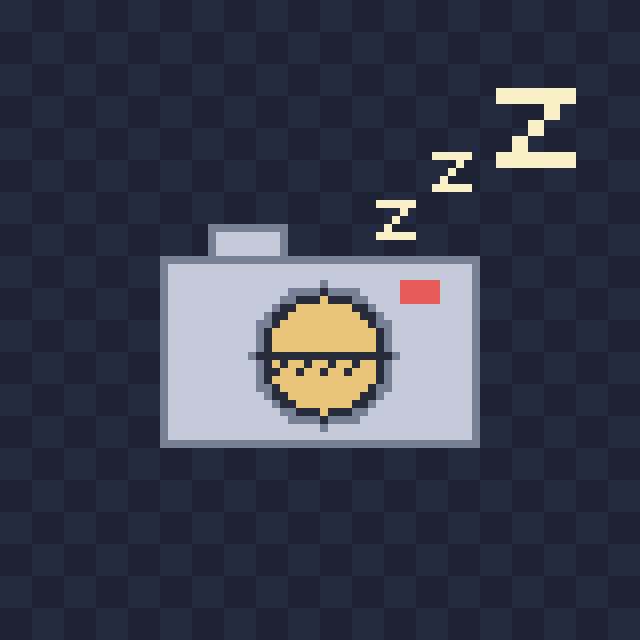

# もくもくカメラ（mokumoco-world サンプルワールド）

もくもく会チャットの「ワールドマップ」に、**カメラの静止画を1分ごとに更新して出す**サンプルです。
動画ではなく、モザイクをかけた写真を1枚ずつ公開します（モザイク 8 なら1枚 2KB 前後）。窓の外・作業机・観葉植物などを、もくもく会のマスにそっと置いておけます。



[もくもくワールド接続プロトコル v1（mokumoco-world）](https://github.com/haya256/mokumoku-suru-tameno-nanika/tree/main/docs/world-protocol) の「提供側」を、Python の標準ライブラリと ffmpeg だけで作っています。
「この仕様に沿えば、もくもく会の部屋以外のものもマップに置ける」という例として読んでください。

## できること

- カメラで1分ごと（設定で変更可）に1枚撮って公開する。もくもく会チャットのマスに出る絵が自動で差し替わる
- 管理画面の「📸 今すぐ更新」で、好きなタイミングで撮り直せる（次の自動撮影はそこから数え直す）
- 画像にモザイクをかける（ピクセルアート風。部屋の絵とも雰囲気が合う）。粗さは管理画面の「➕ 粗く」「➖ 細かく」で変えられ、変えるとすぐ撮り直す
- 管理画面の「⏸ 一時停止」か**シャッターファイル**で、撮影をすぐに止める。止めている間はカメラに触らず、マスには上の「おやすみ中」の絵が出る
- 配信の開始・一時停止・再開を、相手のもくもく会のチャット欄にお知らせとして流す

## 動かし方（Windows）

必要なもの:
- Python 3.11 以上（追加のパッケージは不要）
- [ffmpeg](https://ffmpeg.org/)（`ffmpeg` コマンドが使えること）
- [cloudflared](https://developers.cloudflare.com/cloudflare-one/connections/connect-networks/downloads/)（`winget install Cloudflare.cloudflared`）。Cloudflare のアカウントは不要です

このフォルダを Windows 側に置いてから、PowerShell で:

```powershell
# 1. カメラの名前を調べる
python camera_world.py --list-cameras

# 2. 設定を作り、device にカメラの名前を書く
copy config.sample.json config.json
notepad config.json

# 3. 起動（サーバーとトンネルが立ち上がり、公開URLが表示される）
powershell -ExecutionPolicy Bypass -File start.ps1
```

表示された `https://xxxx.trycloudflare.com` を、もくもく会チャットの **「ワールド設定」→ もくもくルーム（通常）** に登録します。
このURLは**起動のたびに変わる**ので、起動し直したら登録し直してください。

管理画面は `http://127.0.0.1:8788` です（このパソコンのブラウザでだけ開けます）。

### カメラが無い環境で試す

`config.json` の `source` を `"test"` にすると、ffmpeg のテスト映像で動きます（WSL や Linux でも可）。

```json
{ "source": "test", "interval_sec": 10 }
```

```bash
python3 camera_world.py
curl http://127.0.0.1:8787/world-api/v1/snapshot
```

Linux の USB カメラを使うときは `"source": "v4l2", "device": "/dev/video0"` です。

## 設定（config.json）

書かなかった項目は既定値になります。

| 項目 | 既定値 | 意味 |
|---|---|---|
| `title` | `もくもくカメラ` | マスに出る名前 |
| `port` | `8787` | 公開用のポート（これだけをトンネルに渡す） |
| `admin_port` | `8788` | 管理画面のポート（トンネルには渡さない） |
| `interval_sec` | `60` | 自動撮影の間隔（秒） |
| `size` | `640` | モザイク無しのときの画像の一辺。マスが正方形なので、カメラの映像を縦横比のまま収め、余白を黒くした正方形にする |
| `pixelate` | `8` | モザイクの粗さ。8 なら一辺 80 ドットの画像を送る（`size` ÷ `pixelate`）。`1` でモザイク無し。起動時の値で、管理画面のボタンで 1・2・4・8・16・32 に変えられる（再起動するとこの値に戻る） |
| `source` | `dshow` | `dshow`（Windows）/ `v4l2`（Linux）/ `test`（テスト映像） |
| `device` | | カメラの名前（`dshow`）またはデバイスのパス（`v4l2`） |
| `ffmpeg` | `ffmpeg` | ffmpeg のパス（PATH に無いとき） |
| `shutter_file` | `shutter` | このファイルがある間は一時停止する（このフォルダからの相対パス） |

## プライバシーについて（必ず読んでください）

- **公開URLを知っている人は誰でも画像を見られます。** もくもく会チャットの仕様上、つないだ情報はすべて公開が前提です
- 映ってはいけないもの（人の顔、書類、画面、住所の分かる景色など）が映らない向きにカメラを置いてください
- モザイク（`pixelate`）は既定で有効です。弱めるときは映るものをよく確かめてから
- 急いで止めたいときは、次のどちらかで**すぐ**一時停止の絵に変わります
  - 管理画面の「⏸ 一時停止」
  - このフォルダに `shutter` という名前のファイルを置く（中身は空でよい）。消すと再開します
- 一時停止中は `/camera` も返さないので、最後に撮った画像を外から取ることはできません
- 管理画面は `127.0.0.1` でだけ開いていて、ほかのサイトから操作できないよう `Host` と `Origin` を確認しています

## このPCを守るために

公開URLを知っている人は誰でもアクセスできるので、そこからこのPCに入り込まれないよう、次のようにしています。

- トンネルに渡すのは公開用のポートだけです。管理画面は `127.0.0.1` で待ち受けていて、外からも家の中のネットワークからも届きません
- 公開用のポートは、決まった4つの URL を GET で返すだけです。ファイルを読む処理も、リクエストの中身を ffmpeg などに渡す処理もありません。撮影も、外からのアクセスでは起きません
- Cloudflare Tunnel は手元から外へつなぎに行く方式なので、ルーターのポートを開けずに済み、家の IP アドレスも相手に見えません
- 管理画面は、ほかのサイトに埋め込めないようにしています（`X-Frame-Options: DENY`）。透明に重ねた管理画面のボタンを押させる手口（クリックジャッキング）を防ぐためです
- 何も送らずに居座る接続は10秒で切ります
- 応答ヘッダーや画像の中に Python・ffmpeg の版を出しません

使う側で気をつけてほしいこと:

- PowerShell を「管理者として実行」しないでください。万一のときも、被害を普段のユーザーの権限の中に留められます
- Python・ffmpeg・cloudflared は、ときどき更新してください
- 使わないときは `start.ps1` を止めてください。トンネルが消え、外からは一切届かなくなります

## 仕組み

```
カメラ ─ffmpeg─▶ camera_world.py ──(公開用 :8787)── cloudflared ──▶ もくもく会チャット(接続側) ──▶ 参加者
                     │                                              5秒ごとに巡回して中継
                     └─(管理用 :8788, 127.0.0.1のみ)── あなたのブラウザ
```

公開用サーバーが返すのは次の4つだけです。

| URL | 中身 |
|---|---|
| `/.well-known/mokumoco-world` | Discovery（仕様 §2） |
| `/world-api/v1/snapshot` | スナップショット（仕様 §3） |
| `/camera` | 最後に撮った画像（JPEG。一時停止中は 404） |
| `/paused.png` | 一時停止中・撮影前の絵 |

スナップショットの例:

```json
{
  "protocol": "mokumoco-world",
  "version": "1.0",
  "generatedAt": 1791116646.9,
  "space": {
    "type": "camera",
    "title": "窓の外カメラ",
    "image": { "url": "/camera", "version": "1791116643203", "mime": "image/jpeg" },
    "paused": false,
    "capturedAt": 1791116643.2,
    "intervalSec": 60,
    "size": [80, 80]
  },
  "messages": [
    { "id": "sys-1791116642958-1", "ts": 1791116642.9, "author": null,
      "text": "📷 配信を開始しました(60秒ごとに更新)", "system": true }
  ]
}
```

### 仕様のどこを使っているか

- **独自の空間種別**（§4.1）: `space.type` は仕様に無い `"camera"`。今の接続側は知らない種別を、題名と絵だけのマスとして表示します
- **画像の版**（§6.2）: 撮るたびに `image.version` を変えます。接続側は版が変わったときだけ画像を取り直すので、1分に1回の更新でも余計な通信はありません。参加者のブラウザはこのサーバーに直接アクセスせず、接続側が中継します（参加者が何人いても、こちらへのアクセスは接続側からだけ）
- **チャット**（§5）: お知らせを `system: true` の発言として載せると、相手のもくもく会のチャット欄に時系列で混ざって流れます。種別に関係なくチャットは届きます
- **知らないものを無視する**（versioning.md）: `paused` `capturedAt` `intervalSec` `size` は今の接続側には意味がなく、無視されます。将来の接続側が `camera` 種別に対応すれば、「撮影時刻を添える」「次の更新までのカウントダウンを出す」などに使えます。提供側は先に情報を載せておけるわけです

### 送る画像を小さくしている工夫

モザイクをかけるときは、640x640 の画像にモザイクをかけて送るのではなく、**1ブロックを1ピクセルにした小さい画像**（モザイク 8 なら 80x80）を送ります。
もくもく会チャットはマスの絵をドット絵用の拡大（`image-rendering: pixelated`）で表示するので、見た目は同じまま、1枚が数十KB から 2KB 前後に減ります。

- 小さい画像は、色を間引かない JPEG（4:4:4）で保存します。普通の JPEG（4:2:0）は色を半分の解像度で持つので、拡大すると1ドットずつ隣へ色がにじみます
- PNG は使いません。カメラの映像にはノイズがあり、PNG だと JPEG の数倍の大きさになるためです
- ドット絵用の拡大をしない接続側では、ぼやけて表示されます

### 応用のアイデア

同じ形（独自の種別 + 時々変わる絵 + お知らせ）で、いろいろな「場所」をマップに置けます。

- 定点観測: 植物の成長、空模様、作業机
- 作業中のホワイトボードやノートをそのまま映す
- 画像を撮る代わりにプログラムで描く: 天気・気温の計器盤、サーバーの状態、ゲームの盤面
- お知らせだけを流す: 「〇〇が完成しました」「雨が降り出しました」
